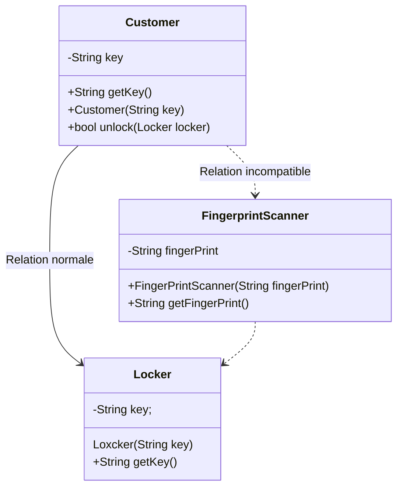

Les objets de la librairie "FingerPrintScanner" n'acceptent que le type "empreinte".

```mermaid

classDiagram
    class Customer{
        -String key
        +String getKey()
        +Customer(String key)
        +bool unlock(Locker locker)
    }

    class Locker {
        -String key;
        Loxcker(String key)
        +String getKey()
    }

    class FingerprintScanner {
        -String fingerPrint
        +FingerPrintScanner(String fingerPrint)
        +String getFingerPrint()
    }

    Customer --> Locker : Relation normale
    Customer ..> FingerprintScanner : Relation incompatible
    FingerprintScanner ..> Locker


```
